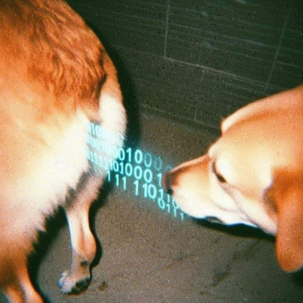

  
<h1>嗨 Hi there, I'm Matteo 👋</h1>

Welcome to my GitHub profile! I'm a technology and art enthusiast, often experimenting with Raspberry Pis and AI technologies. Feel free to call me by any name you fancy!

<h2>🛠️ Technical Skills</h2> 

My primary coding languages include:

<ul>
  <li>JavaScript</li>
  <li>C</li>
  <li>C++</li>
  <li>Python</li>
</ul>

I'm always working on several projects (some of them might be perpetually in progress \(^o^)/ ), particularly in the field of domotics, AI, arts and crafts.

<h2>🕹️ Interests</h2>

Apart from coding, I'm a huge fan of arts and crafts, photography, language learning and games. If you've got any game recommendations, I'm all ears!

<h2>📬 Get in Touch</h2>

I'm always open to collaboration, interesting project ideas, or just a casual chat. Don't hesitate to reach out for any reason!

We are all compilers and interpreters

  

  
 

